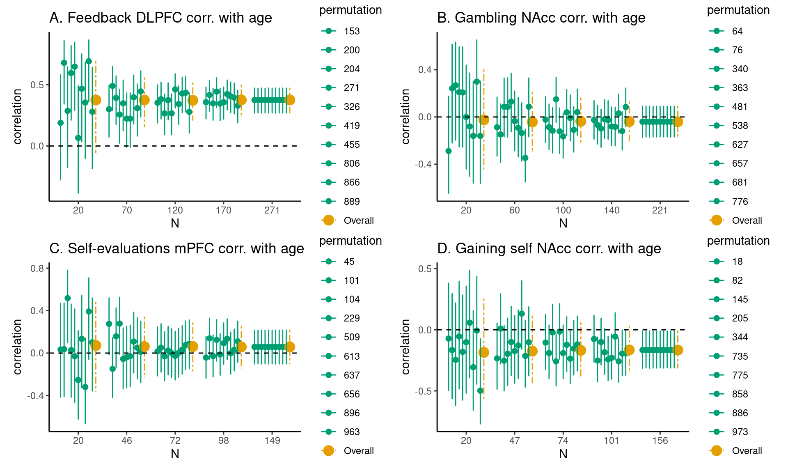
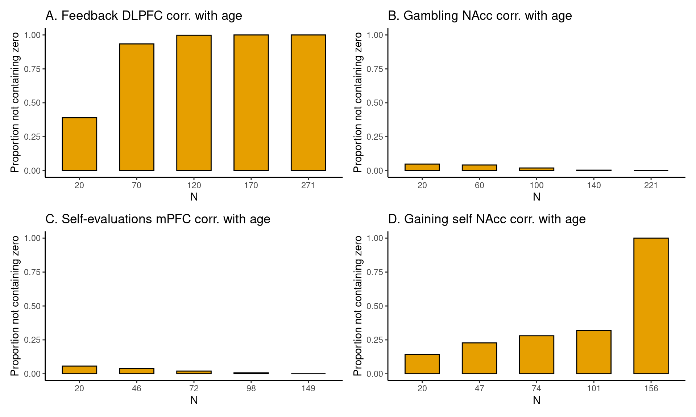

```{r logo, echo=FALSE, fig.align='center', fig.pos='H', message=FALSE, out.width='0.3\\linewidth'}
temp <- tempfile(fileext = ".pdf")
download.file(url = "https://codecheck.org.uk/img/codecheck_logo.pdf", destfile = temp)
knitr::include_graphics(temp)
```

## Prerequisites

I conducted a codecheck of the git repository <https://github.com/eduardklap/sample-size-codecheck.git>, which was created by the author. As suggested in the community-workflow, this document is strongly based on the codecheck [example](https://codecheck.org.uk/guide/community-workflow#examples) by Daniel Nüst of Hopfield-1982 (<https://github.com/codecheckers/Hopfield-1982/blob/master/codecheck/codecheck.Rmd>).

-   `README` file exists
-   `LICENSE` file exists
-   `codecheck.yml` file exists

```{r read_codecheck_yaml, message=FALSE, warning=FALSE, include=FALSE}
library("here") # will start one level up because there is a .git
library("yaml")
codecheck_yaml = yaml::read_yaml(here::here("codecheck.yml"))
```

```{r url_hack,include=FALSE}
## Temporary hack to make URL
url_it = function(url) {
  url = sub("<", "\\\\url{", url)
  url = sub(">", "}", url)
  url
}
```

---
title: "`r paste("CODECHECK certificate", codecheck_yaml$certificate)`"
# somehow subtitle in second code chunk does not work
# subtitle: "`r codecheck_yaml$report`"
date: "Report DOI: `r codecheck_yaml$report`` \\newline Check time: `r codecheck_yaml$check_time`"
---

## The CODECHECK

This report checks the code of the article *`r codecheck_yaml$paper$title`* (`r codecheck_yaml$paper$reference`). See section [Notes](notes) for details about running the code.

**The CODECHECK was successful**. The created figures `figures_cohens_d.html` and `figures-correlations.html` are visually very close to the one in the repository.

The reproduction of the figures from the repository was easy due to the workflow and integration with Quarto and RStudio.

\clearpage

# Codechecker notes {#notes}

The following files are uploaded to a deposit on Zenodo from the directory `codecheck/` in the repository:

1.  I agreed to do the codecheck and read the [CODECHECK process](https://codecheck.org.uk/process/) and the [README.md](https://github.com/eduardklap/sample-size-codecheck?tab=readme-ov-file) from the associated project.
2.  As suggested under *Workflow*, I created a new RStudio project (Version control) and entered the URL of the forked repository to clone it. This was my R version at that time:

```{r Session Info}
print(sessionInfo())
```

3.  I installed the packages. Both failed to install due to my folder having a 00LOCK folder. I deleted the folder which led to the package successfully installing. neuroUP also installed dependency 'boostrap'. I later also installed the float package hoping that this would result in the Codecheck image being displayed but it did not.

```{r Packages}
# # not run
# install.packages("neuroUp")
# install.packages("patchwork")
# install.packages("float")
```

4.  I opened figures-cohens_d.qmd and clicked on render at **11:33 CEST**. During the runtime I went back to the [CODECHECK documentation](https://codecheck.org.uk/guide/community-workflow). The Background Job quickly stalled at `16% [fig-1a]`. It increased to `48%` by 13:46 CEST. It was still `48%` at 15:47 CEST (after \~3.5 hours). A markdown file opened itself "**Code for Figures 1-2 based on Cohen's d**" after \~8 hours. The background job kept running. I stopped the job after more than 8 hours (8:33:40). I do not know why the background job kept running despite the files already being created.
5.  I started rendering the code of the **figures-correlations** at 21:11 CEST. The rendering was finished at 22:47 CEST.
6.  I created a directory *codecheck* and saved this file in it.
7.  I could not write a Makefile to re-run the workflow.
8.  Visual inspection of the figures: I compared the four files fig-X-total-1 that include all other figures (see below). I switched between the original and the reproduced file, respectively. They differed with respect to the line width of the dashed lines and some other minor parts of the format. Besides these difference, I could successfully reproduce the results.

Here are the original figure from the directory `code/` and the reproduced figure from the directory `codecheck/`:

## Original and Reproduced Figures

```{r fig-1-original, echo=FALSE, fig.align='center', fig.cap='Original figure 1', message=FALSE, out.width='0.6\\linewidth'}
knitr::include_graphics("../figures-cohens_d_files/figure-html/fig-1-total-1.png")
```

```{r fig-1-checked, echo = FALSE, message=FALSE, fig.align='center', fig.cap='Reproduced figure 1', out.width='0.6\\linewidth'}

```

```{r fig-2-original, echo = FALSE, message=FALSE, fig.align='center', fig.cap='Original figure 2', out.width='0.6\\linewidth'}
knitr::include_graphics("../figures-cohens_d_files/figure-html/fig-2-total-1.png")
```

```{r fig-2-checked, echo = FALSE, message=FALSE, fig.align='center', fig.cap='Reproduced figure 2', out.width='0.6\\linewidth'}

```

```{r fig-3-original, echo = FALSE, message=FALSE, fig.align='center', fig.cap='Original figure 3', out.width='0.6\\linewidth'}

```

```{r fig-3-checked, echo = FALSE, message=FALSE, fig.align='center', fig.cap='Reproduced figure 3', out.width='0.6\\linewidth'}

```

```{r fig-4-original, echo = FALSE, message=FALSE, fig.align='center', fig.cap='Original figure 4', out.width='0.6\\linewidth'}

```

```{r fig-4-checked, echo = FALSE, message=FALSE, fig.align='center', fig.cap='Reproduced figure 4', out.width='0.6\\linewidth'}

```
